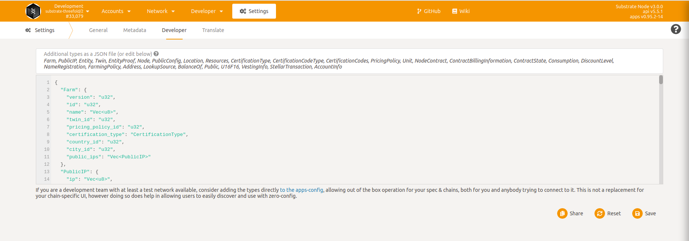

# Test setup

Steps to deploy a test scenario using zos3, yggdrasil,polkadot.

## Create twin

### 1. Create account on substrate using polkadot

- Add the required [types in json format](https://github.com/threefoldtech/tfgrid-api-client/blob/master/types.json) to the [developer settings](https://polkadot.js.org/apps/?rpc=wss%3A%2F%2Fexplorer.devnet.grid.tf%2Fws#/settings/developer) in polkadot. *note: don't forget to save*


- Click on `Add an account` in [polkadot accounts](https://polkadot.js.org/apps/?rpc=wss%3A%2F%2Fexplorer.devnet.grid.tf%2Fws#/accounts)
- Save the mnemonic seed in a safe place

- Click on `Advanced creation options` and select the keyword crypto type of **`Edwards (ed25519, alternative)`**
`

- Add a name and password for your account (remember the password for future usage)


- Fund the account with test funds (Click on send funds from the account of Alice to your account name)


### 2. Setup yggdrasil (optional to obtain public Ipv6 address)

- download and install yggdrasil using the following [link](https://github.com/yggdrasil-network/yggdrasil-go/releases/tag/v0.4.0)
- Start it initially to init the configurations:

        systemctl start yggdrasil
    Or using

        yggdrasil -useconffile /etc/yggdrasil.conf
- Add the needed [peers](https://publicpeers.neilalexander.dev/) in the config file generated under Peers.

  **example**:

        Peers:
        [
        tls://54.37.137.221:11129
        ]

- Restart yggdrasil by

        systemctl restart yggdrasil


### 3. Create twin on substrate using polkadot

- Select the options to create the twin in [polkadot developer extrinsics](https://polkadot.js.org/apps/?rpc=wss%3A%2F%2Fexplorer.devnet.grid.tf%2Fws#/extrinsics)

  - Selected account -> your Account name

  - Extrinsic module to be submitted(from drop down menu) -> tfgridModule

  - Extrinsic method to be submitted -> createTwin(ip)

  - ip -> Ipv6 obtained from your yggdrasil
- Submit transaction and enter password selected when creating the account


- To get your twin ID, select the options required in [polkadot developer chainstate](https://polkadot.js.org/apps/?rpc=wss%3A%2F%2Fexplorer.devnet.grid.tf%2Fws#/chainstate) and click on the +
  - Module -> tfgridModule
  - Method -> twinID(): u32


## Start RMB (Reliable Message Bus)

- Clone the [RMB repo](https://github.com/threefoldtech/rmb)

- Run the [script to build a static binary for the rmb](https://github.com/threefoldtech/rmb/blob/master/build/alpine-static.sh) with the name `msgbusd`

- run RMB using

        ./msgbusd --twin <TWIN_ID>

## Create deployment

The deployment will include a kubernetes cluster consisting of a master and a worker machine on 2 VMs on the same node.

To have the successful deployment it should include the following:

- 1 network deployment (znetwork)
- 2 disk (zmount)
- 2 virtual machines (zmachine) where one is considered the master node and the other is the worker node
- 1 public IP attached to the kubernetes master node

### To deploy

### 1. Run test script with twinId to deploy 2

The test script can be found and used by following the steps in the README of [grid3_client_ts repo](./README.md)

### 2. Connect to the deployment over the public network

Edit `get_deployment.ts` script with the contract ID and Run it to get the deployment result.

```bash
cd ../scripts
tsc get_deployment.ts && node get_deployment.js 
```

And get the public IP from the public IP workload result.

```json
        ...
        {
            "version": 0,
            "name": "zpub",
            "type": "ipv4",
            "data": {},
            "metadata": "zpub ip",
            "description": "my zpub ip",
            "result": {
                "created": 1629128139,
                "state": "ok",
                "message": "",
                "data": {
                    "ip": "185.206.122.33/24",
                    "gateway": "185.206.122.1"
                }
            }
        }
        ...
```

Then ssh to the master public IP.

```bash
ssh root@<public_ip>
```

### 3. Wireguard needed to connect to the deployment over the private network

    [Interface]
    Address = 100.64.240.2/32
    PrivateKey = yYKiE0BFVt3fYYsbzLpApj1xPsdK3Xmw6BCLHCvWdHM=
    [Peer]
    PublicKey = XrL1Kl3oP1JTonHqTjt3Ig1A2re6A4/Fi9nn44+TOgM=
    AllowedIPs = 10.240.0.0/16, 100.64.240.1/32
    PersistentKeepalive = 25
    Endpoint = 185.206.122.31:6835
