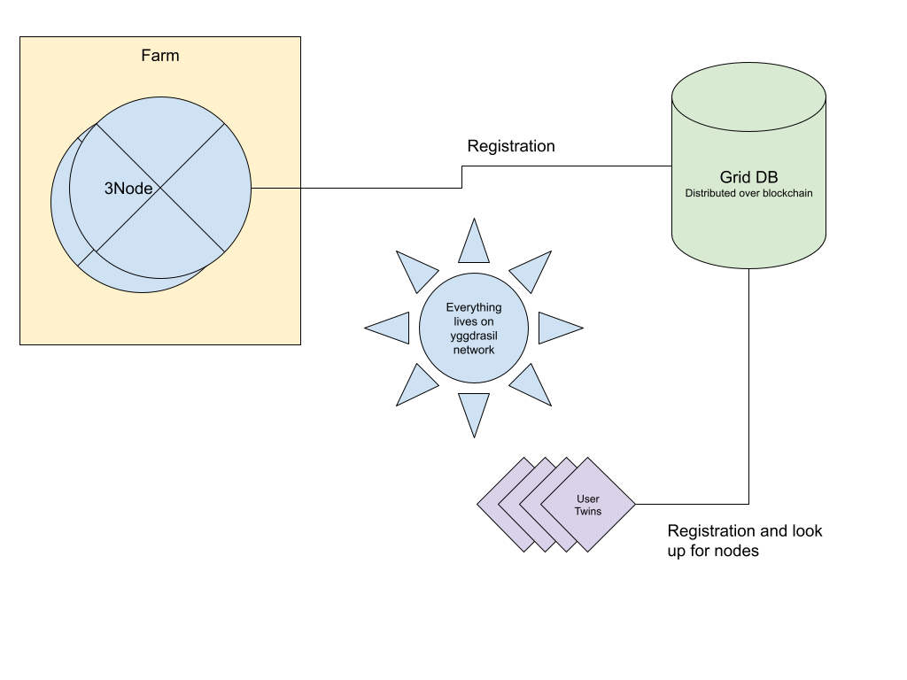
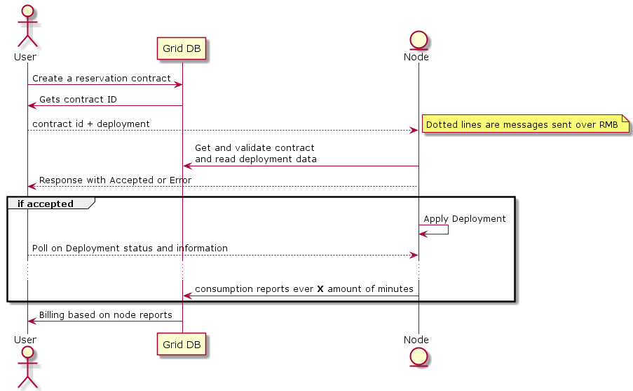

# Introduction

> TODO: this doc needs to be broken apart in different parts

This document is about tf-grid 3.0. It shows an overview of the grid regarding operation, and how different components communicate to each other.

## Definitions

- 3Node: a machine that runs zos operating system.
- RMB: Reliable Message Bus
- Grid-DB: a decentralized block chain database that allows nodes and other twins to share trusted data. Anyone can look up nodes and verify their identity, find their corresponding twin IDs to communicate over RMB.

## What's new ?

TFGrid 3.0 is a full redesign of the ThreeFold Grid architecture. The main purpose of this redesign is to decentralize all the components that the Grid is built with. 

### TFChain 3.0

A decentralised chain holding all information on entities that make up the ThreeFold Grid. It runs on Parity Substrate blockchain infrastructure. 

Features :
- Your identity and proofs/reputation on our blockchain
- All info about TFGrid (nodes, farmers, …)
- A Graphql interface to be able to query the blockchain
- Support of side chains (unlimited scalability, allow others to run their own blockchain)
- TFT exists now also on TFChain (allows us to work around Stellar scalability issues)
- Bridge between TFT on Stellar and TFT on TFChain (one way to start)
- Blockchain based provisioning process
- TFChain API (javascript, golang, vlang)
- Support for 'Infrastructure as Code' : IAC frameworks 
   - Terraform
   - Kubernetes, Helm, Kubernetes
   - Ansible (planned for Q4 2021)
- Use RMB = peer2peer secure Reliable Message Bus to communicate with Zero-OS

### Billing
- Resource utilisation is captured and calculated on hourly basis
- Resource utilisation stored in TFChain
- An automated discount system has been put in place, rewarding users who pre-purchased their cloud needs. Price discounts are applied, in line with amount of TFT you have in your account and the period you are holding these TFT.
E.g. if you have 12 months worth of TFT in your account in relation to the last hour used capacity you get 40% discount, 36 months results in 60% discount. 

### New Explorer UI
- An updated User Interface of the TF Grid Explorer, nicer and easier to use
- It uses the Graphql layer of TFChain

## Overview

The architecture can be described as follows:
- Everything that needs to talk to other components should live on the network of components that talk to each other through Yggdrasil (the 'Yggdrasil network').
- Nodes and users have to create a “twin” object on Grid-DB which is associated with an Yggdrasil IP address. Then to communicate with any twin, the IP can be looked up using the twin ID. This is basically how RMB works.
- When starting for the first time, the node needs to self-register on the Grid-DB, which is a decentralized database, built on top of Substrate. The registration need to have information about:
  - Which farm it belongs to
  - What capacity it has
  - Twin ID for that node (which is associated with its Yggdrasil IP)
  - Public Configuration
- Once an identity has been created, secure and trusted communication can be established between the different parties.
- Before deploying a workload, a user needs to go through the following steps :
  - Create a **contract** on Substrate, which describes the conditions under which capacity is reserved (with whom, for how long, ...)
    - The **contract** is described in more details [here](contract)
    - It also has required number of public IPs to be reserved from the farm (in case you have public ips in your deployment definition)
  - Substrate needs to validate the contract, user, funds and lock up required public ips from the farm object.
  - Once a contract is created, the contract **id + deployment** is sent to the node.
  - The node then can read the contract data, validate and apply them. Deployment status can then be queried over RMB directly from the node.
  - Node will also send consumption reports to the contract, the contract then can start billing the user.

# 3node
On first boot the node needs to create a “twin” on the grid, a twin associated with a public key. Hence it can create verifiable signed messages.
Then, a node will then register itself as a “node” on the grid, and links this twin to the node object.

Once the node is completely up, a user can reach out to the node to submit workload requests.
Responses from the node **MUST** be signed with the twin secret key, a user then can verify it against the node public key.

Node uses the same verification mechanism against requests from twins.

# Concerns
- Stellar - Substrate token bridge. How should we do this? Transaction on the grid db will cost tokens (economic protection)
- Deployments are not migrateable from a node to another. If a node is not reachable anymore or down. It’s up to the owner to delete his contract and recreate it somewhere else.

# Grid DB
## Definitions
- `entity`: this represents a legal entity or a person, the entity is the public key of the user associated with name, country, and a unique identifier.
- `twin`: represents the management interface that can be accessed over the yggdrasil ipv6 address. A twin is associated also with a single public key.

On the grid, we build on top of the above concepts a more sophisticated logics to represent the following: (note, full types specifications can be found here)
- farm: a farm is associated
  - entity-id: this defines the entity of the farm itself, so it holds information about the country, city, etc and public key.
  - twin-id: the communication endpoint for this farm.
- node:  associated with
  - entity-id: defines the entity of the node itself, (pubkey, city, country, etc…)
  - twin-id: defines the peer information (peer-id and public ipv6)
  - farm-id: unique farm id this node is part of.

The grid database is a decentralized blockchain database that leverages on substrate to provide an API that can be used to
- Create Entities
- Create Twins
- Add / Remove entities from twins
- Create Nodes
- Create Farms
- Create Pricing policies for farms
- Create Certification Codes
- Query information about  entities (find node, or verify identities)

A farm has one twin, through this twin the peer_id and entity can be requested. This is also the case for nodes as they have one farm.

# Public IPs
Public IPs are assigned by the grid database from the farmer IPs pool. For this to be possible, on contract creation the user need to specify how many IPs he requires.

If the contract creation is successful it means the contract managed to acquire the required number of Ips. The IPs are going to be available for this specific node.

Once the contract is terminated, the Ips are returned back to the farmer pool.

# Pricing
Each farmer object is assigned a Pricing Policy object:
The pricing policy defines:
- Currency (TFT, USD, etc…) _we will probably drop that_
- SU
- CU
- NU

## General notes:
- Each price defines a price for a single UNIT/SECOND. So for example SU is the price of a single Storage Unit per second where a Storage Unit can be 1 Gigabyte
- The price is defined as `mil` of the currency. 1 UNIT = 10,000,000 mil

### Example:
Currency: TFT
SU: 1000 (mil tft)

(Price for 1 Gigabyte of ssd storage costs 1000 / 10 000 000  TFT per second)

So let's assume capacity is created at **Time = T**
- Node send first report at **T+s** with SU consumption C = (10 gigabytes)
- price = C/(1024*1024*1024) * s * SU
- price = 10 * s * SU
- Assume s is 5 min (300 seconds)
- Then price = 10 * 300 * 1000 = 3000000 mil = 3 TFT

Same for each other unit EXCEPT the NU. The NU unit is incremental. It means the node will keep reporting the total amount of bytes consumed since the machine starts. So to correctly calculate the consumption over period S it has to be `now.NU - last.NU`